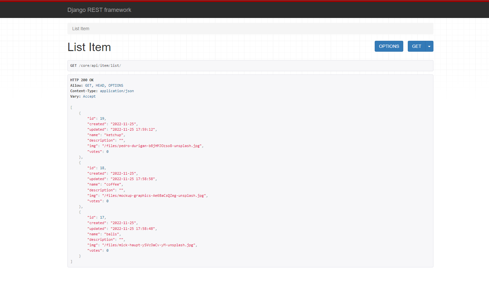

<h1 id='project-name'>PP Project Backend</h1>

> A simple backend project, which provides the JWT authentication flow using django rest framework and simple_jwt. In addition, it provides routes for registering, deleting and listing items. Project developed for study purposes.

## 💻 Prerequisites

Before starting, make sure you've met the following requirements:

* `Python>=3` 
* **Recommended** python virtual environment. 
* Windows, Mac or Linux, operational system.

## 🚀 How to run

1 - `clone this repository`
2 - `cd clone directory/pp-backend`
3 - run `pip install -r requirement.txt` for install dependencies
4 - run `python manage.py makemigrations` and then `python manage.py migrate`, for create .sqlite3 database.
5 - run `python manage.py createsuperuser` and pass the required informations.
6 - run `python manage.py runserver` for start development server at port 8000. 

## 📝 License

Feel free to use the project, change and share as you wish.

[⬆ Voltar ao topo](#project-name) 