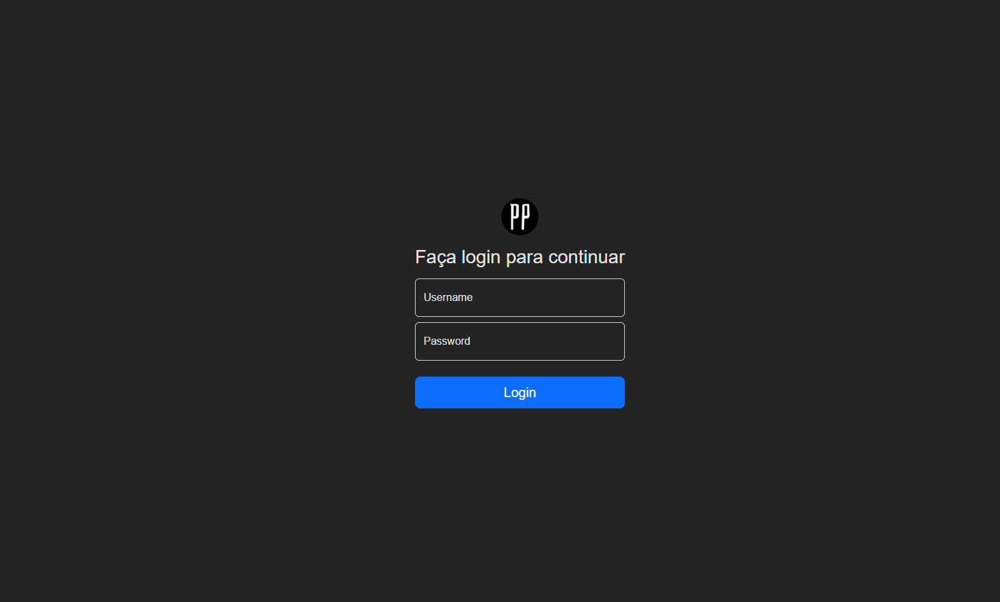

<h1 id='project-name'>PP Project Frontend</h1>

> Simple frontend project for rest API consumption with JWT authentication. Project developed for study purposes.

## 💻 Prerequisites

Before starting, make sure you've met the following requirements:

* Node v18.12.1 + Vue 3 
* **Recommended** YARN dependency manager
* Windows, Mac or Linux, operational system.

#### Recommended IDE Setup

- [VS Code](https://code.visualstudio.com/) + [Volar](https://marketplace.visualstudio.com/items?itemName=Vue.volar)

## 🚀 How to run

1 - `clone this repository`
2 - `cd clone directory/pp-frontend`
3 - run `yarn` for install dependencies
4 - run `yarn dev` for start development server at port 3000

## ☕ How to use.

To use this project it is necessary to configure the Backend project, configure the database, and create a new user for access.
After that, just access the address http://localhost:3000/login, login and use the project. Registering items, with images. And later voting on these items by accessing the free route at http://localhost:3000/vote

## 📝 License

Feel free to use the project, change and share as you wish.

[⬆ Voltar ao topo](#project-name) 